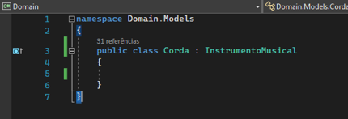
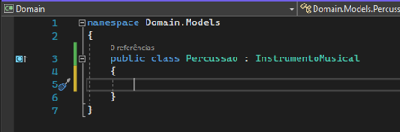
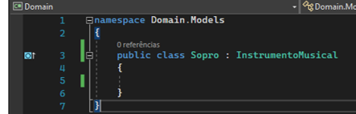
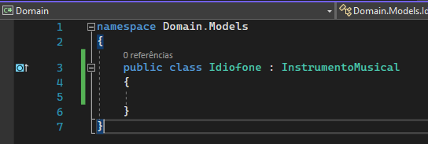
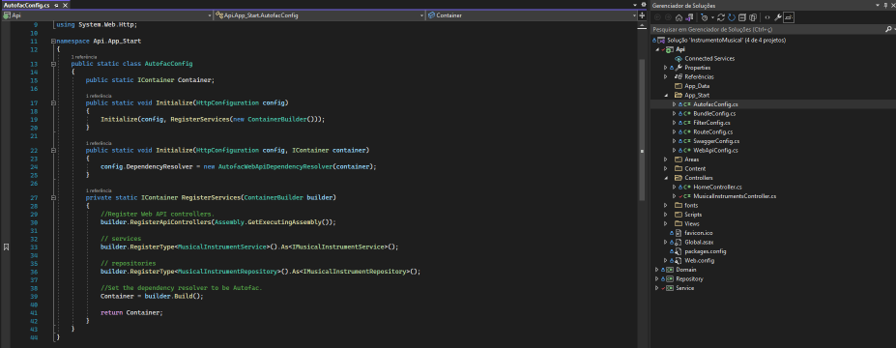
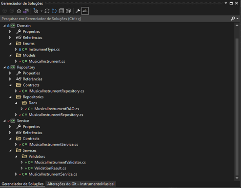

# Instrumentos Musicais
API Rest de Loja de Instrumentos Musicais.

# Projeto Software Engineering Development - Professor: Rafael Matsuyama
Foi decidido pela maioria que o projeto seria desenvolvido em .NET, pois há mais programadores entre os integrantes do grupo que conhecem a plataforma da Microsoft.

# Integrantes

## RM 341621 Bianca Paulino
## RM 337095 Thiago Holanda
## RM 340457 Diogo Camilo
## RM 342168 Bruno Santos

## Tipos de Instrumentos Musicais

1. Cordas: *Instrumentos de cordas são: Guitarra, Violão, Contra-Baixo, Violino, etc.*
2. Percussão: *Instrumentos de Percussão são: Bateria, Pandeiro, Bongo, Tamborim, etc.*
3. Sopro: *Instrumentos de Sopro são: Flauta, Clarinete, Trompa, Trombone, etc.*
4. Idiofone: *Agogó, Caxixi, Reco-reco, Triângulo, etc.*

### Imagens de Guitarra, Bateria, Flauta e Agogó.

### [Guitarra](https://pt.wikipedia.org/wiki/Guitarra)

### [Bateria](https://www.madeinbrazil.com.br/produto/bateria-completa-action-sp525-bk-turbo-preto-bk-71428)

### [Flauta](https://pt.wikipedia.org/wiki/Flauta)

### [Agogó](https://en.wikipedia.org/wiki/Agog%C3%B4)

# Ánalise de Pricípios SOLID no código

## 1. SRP — Single Responsibility Principle:
Princípio da Responsabilidade Única — Uma classe deve ter um, e somente um, motivo para mudar.
Classe *MusicalInstrument* foi criada com único intuito de tratar exibição e manipulação de informações a respeito de um instrumento musical. Criamos também as classes para escopo de serviço para orquestração com a controller e o repositório para persistência de dados.

## 2. OCP — Open-Closed Principle:​
Princípio Aberto-Fechado — Objetos ou entidades devem estar abertos para extensão, mas fechados para modificação, ou seja, quando novos comportamentos e recursos precisam ser adicionados no software, devemos estender e não alterar o código fonte original.
Com a criação da interface IMusicalInstrumentRepository para assinatura de métodos para interação com BD caso venhamos a criar uma nova MusicalInstrumentBrinquedo, mesmo objetos desta classe não sendo instrumentos musicais de verdade a mesma pode utilizar os mesmos métodos de interação com o BD.
## 3. LSP— Liskov Substitution Principle:
Princípio da substituição de Liskov — Uma classe derivada deve ser substituível por sua classe base.
Pelo princípio LSP, a instância de uma classe base deve possibilitar sua substituição por instâncias das classes derivadas sem que se necessita qualquer alteração no código.
Criamos as classes Corda, Percussão, Idiofone e Sopro; que representam categorias de instrumentos musicais. Ambas herdam da classe InstrumentoMusical e possuem as mesmas propriedades.

## 4. ISP — Interface Segregation Principle:
Princípio da Segregação da Interface — Uma classe não deve ser forçada a implementar interfaces e métodos que não irão utilizar.
Interface *IMusicalInstrumentRepository* foi criada com intuito de definir uma interface específica com assinatura de métodos para interação com o banco de dados de objetos do tipo Instrumento Musical. Foram definidos apenas métodos que obrigatoriamente todo instrumento musical possuirá
Interface *IMusicalInstrumentService* foi criada com intuito específico com assinatura de métodos para definição de regras de negócio de objetos do tipo instrumento musical.

## 5. DIP — Dependency Inversion Principle:
Princípio da Inversão de Dependência — Dependa de abstrações e não de implementações.
Classe *MusicalInstrumentDAO* criada com intuito de regra para interação com o BD abstraindo qual vier a ser utilizado. Podemos criar uma interface com assinatura do método de conexão com BD e se caso viermos utilizar MySQL criamos uma classe que implementa a interface e assim criamos métodos específicos para conexão com este BD. Assim no nosso método de Initialize da classe *MusicalInstrumentDAO* podemos enviar um objeto do tipo da interface de conexão para na sequência realizarmos de forma HARD-CODE no código exemplos de instrumentos musicais. Se amanhã decidirmos utilizar outro BD (Oracle) basta criarmos uma nova classe implementando a interface de conexão não alterando nada nas demais interfaces e classes.
Depende de abstrações e não de implementações.
Aplicamos o Design Pattern de Injeção de Dependência utilizando o framework Autofac.

## Implementação AutoFac

## Separação da Camadas

Implementamos uma divisão de pastas para cada contexto, seguindo orientações de alguns Padrões de Projeto. Separamos a camada da Controller e as camadas de Serviço e Repositório. Criamos uma camada de Domínio para armazenar os classes modelos que são usadas por outros serviços.

A Classe MusicalInstrumentDAO, baseada no padrão de projeto Data Access Object, criada com intuito de regra para interação com o BD abstraindo qual vier a ser utilizado. Podemos criar uma interface com assinatura do método de conexão com BD e se caso viermos utilizar MySQL criamos uma classe que implementa a interface e assim criamos métodos específicos para conexão com este BD. Assim no nosso método de Initialize da classe MusicalInstrumentDAO podemos enviar um objeto do tipo da interface de conexão para na sequência realizarmos de forma HARD-CODE no código exemplos de instrumentos musicais. Se amanhã decidirmos utilizar outro BD (Oracle) basta criarmos uma nova classe implementando a interface de conexão não alterando nada nas demais interfaces e classes.
